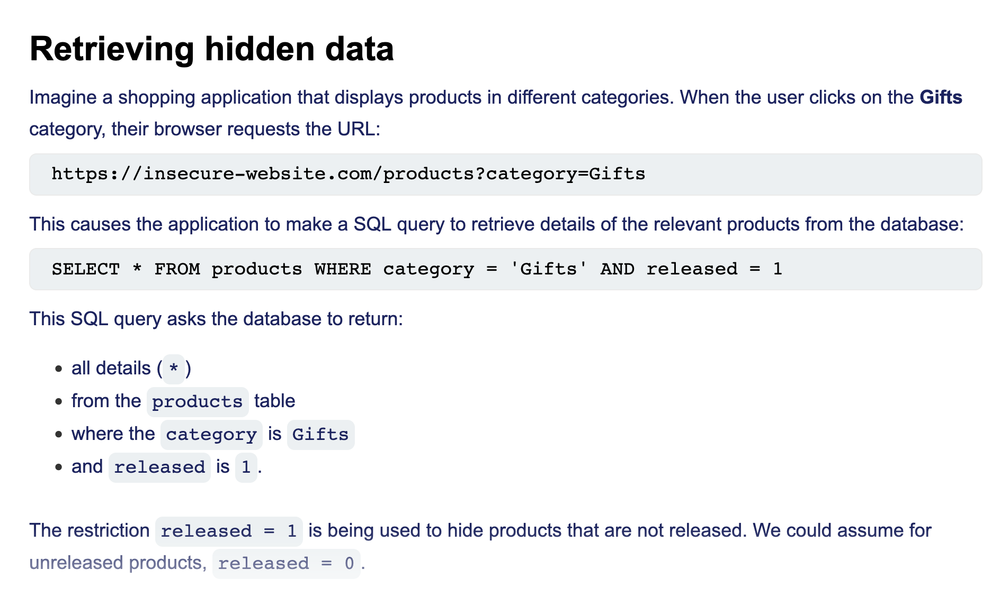
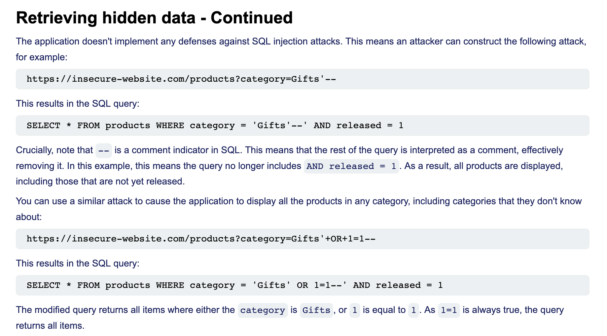

# A03:2021 - Injection

## Definition

คือช่องโหว่ที่ระบบสามารถใส่ Command บางอย่างผ่าน Input ที่ระบบมีอยู่ แล้วส่งไป Execute ที่ระบบหลังบ้านได้ โดยในในที่นี้จะโฟกัสไปที่ SQL Injection ซึ่งเป็น web security vulnerability ที่ิทำให้ attacker สามารถแทรกแซงการ queries ทำให้ attacker สามารถดูข้อมูลที่ปกติแล้วไม่สามารถดึงข้อมูลได้ ซึ่งอาจรวมถึงข้อมูลของผู้ใช้รายอื่น หรือข้อมูลอื่นๆ ที่แอปพลิเคชันสามารถเข้าถึงได้

หรือ Cross Site Scripting (XSS) ที่หน้าเว็บไซต์อาจรับ Script ไปรันดึงข้อมูลหลังบ้านมาแสดงได้

- **Impact:** What can an attacker achieve?
- **Example:** Real-world example if available.

## Root Cause Analysis

- ขาดการตรวจสอบ และกรองข้อมูลจาก Input
- ไม่กำหนดรูปแบบการรับ Input เช่น ไม่รับอักขระ หรือ ตัวอักษะพิเศษ

### How to detect SQL injection vulnerabilities

- ตรวจสอบ และกรองข้อมูลจาก Input ว่ามีรูปแบบที่น่าสงสัยมั้ย เช่น single quote character `'`.
- เช็ค Boolean conditions such as OR 1=1 and OR 1=2, and look for differences in the application's responses
- เช็ตแต่ละ trigger time delays when executed within a SQL query, and look for differences in the time taken to respond.
- Most SQL injection vulnerabilities occur within the `WHERE` clause of a `SELECT` query. Most experienced testers are familiar with this type of SQL injection.

### Example

 `--` is a comment indicator in SQL.
